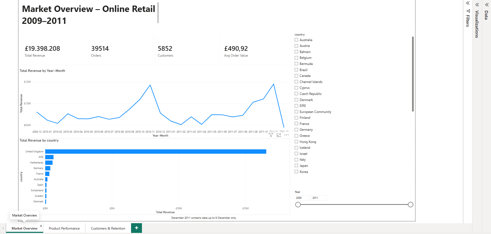
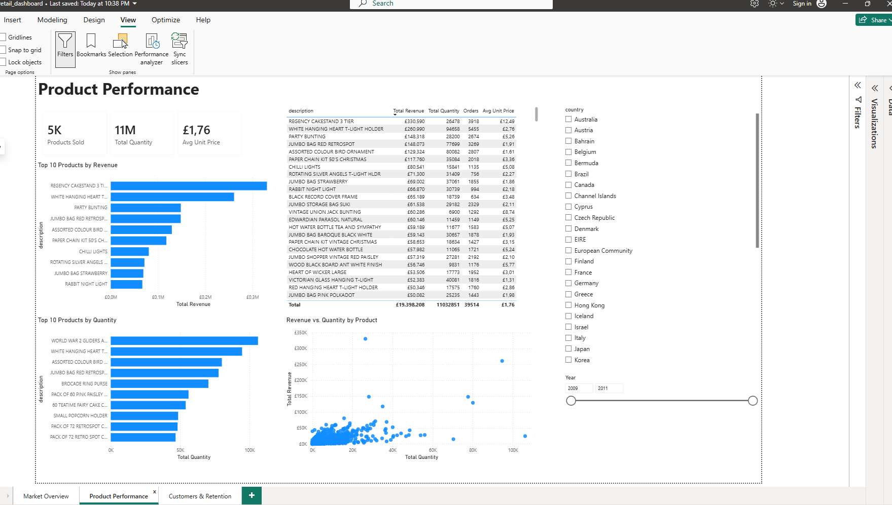
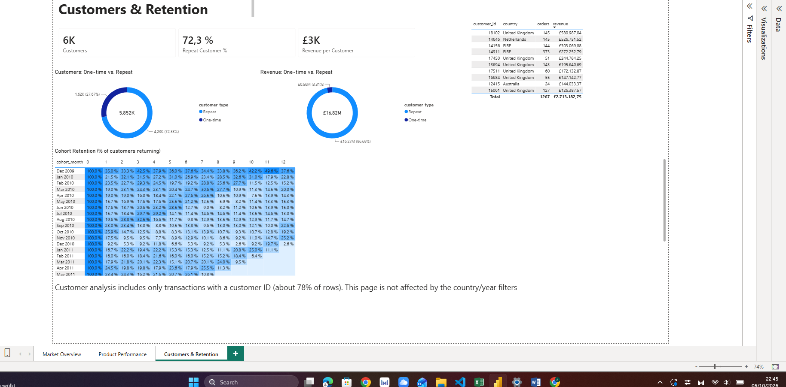

# Online Retail Sales Performance Analysis

End-to-end analysis of about 1 million transactions from a UK-based online gift retailer
(December 2009 – December 2011, about 40 countries), from raw data to an interactive dashboard.

**Tools:** Python (pandas) · MySQL · SQL · Power BI · Git/GitHub

## Business Questions
1. How are sales developing over time, and which markets drive revenue?
2. Which products drive the business – high-price items or high-volume items?
3. Do customers come back, and how loyal are they over time?

## Key Findings
- **£19.4M revenue from 39,514 orders and 5,852 customers** (average order value £490.92).
- **Strong seasonality:** revenue peaks every autumn, with the highest months in November 2010
  and November 2011 – the Christmas stocking season for a gift wholesaler.
- **Market concentration:** the United Kingdom accounts for 85.3% of revenue; the next largest
  markets are EIRE, Netherlands, Germany, France.
- **Price vs. volume:** the top product by revenue (Regency Cakestand 3 Tier, about £330k) is not
  in the top 10 by quantity – the volume leaders are low-priced items such as cake cases and gliders.
- **Repeat customers drive the business:** 72% of identified customers bought more than once,
  and they generated about 97% of identified-customer revenue.
- **Retention drops sharply after the first purchase:** typically only 15–25% of a new cohort
  buys again in month 1. The December 2009 cohort is much more loyal (35–50% per month),
  likely because it contains long-standing customers.

**Recommendation:** focus on converting first-time buyers into repeat customers – for example
with follow-up offers in the first month and well-timed campaigns before the autumn peak.

## Approach
1. **Data cleaning (Python):** removed duplicates, invalid prices, non-product codes (postage,
   fees, adjustments, gift vouchers) and two erroneous order/cancellation pairs; flagged
   cancellations instead of deleting them. Every decision is documented in the
   [cleaning notebook](notebooks/01_data_cleaning.ipynb).
2. **Data pipeline:** loaded the cleaned data (1,021,268 rows) into MySQL and added indexes.
3. **SQL analysis:** KPIs, monthly trends with month-over-month growth, market share, top
   products, cancellation rates, repeat customers and cohort retention
   ([analysis queries](sql/02_analysis.sql), [views](sql/03_views.sql)).
4. **Power BI dashboard:** three pages – Market Overview, Product Performance,
   Customers & Retention ([PDF export](powerbi/online_retail_dashboard.pdf)).

## Dashboard

| Product Performance | Customers & Retention |
|---|---|
|  |  |

## Data Notes & Limitations
- About 22% of rows have no customer ID; they are included in revenue but excluded from
  customer analysis.
- December 2011 contains data up to 9 December only.
- Revenue excludes cancelled orders.

## Repository Structure

├── notebooks/ Python data cleaning
├── sql/ setup, analysis queries and views
├── powerbi/ dashboard (.pbix) and PDF export
└── images/ dashboard screenshots

## How to Reproduce
1. Download the dataset (link below) and place `online_retail_II.xlsx` in `data/raw/`.
2. Run `notebooks/01_data_cleaning.ipynb` (requires a local MySQL database `online_retail`).
3. Run the scripts in `sql/` in order, then open the Power BI file.

## Data Source
Chen, D. (2012). *Online Retail II* [Dataset]. UCI Machine Learning Repository.
https://doi.org/10.24432/C5CG6D — licensed under CC BY 4.0.